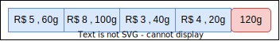
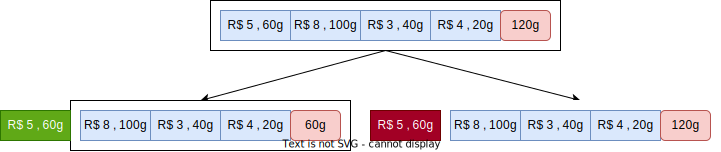
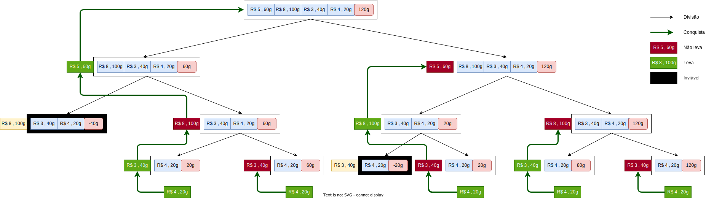

# Algoritmos de Otimização Combinatória em Grafos

Neste módulo, vamos estudar alguns algoritmos de otimização combinatória em grafos para os problema estudados no módulo anterior.


---

# Problema da Mochila

Dados um **conjunto de itens**, cada um com um **peso** e um **valor**, e uma mochila com **capacidade máxima**, o problema da mochila consiste em selecionar itens para **maximizar o valor total**, **sem exceder a capacidade** da mochila.


---

## Anedota 

* Imagine que  você encontrou um **gênio** na caverna que pode resolver o problema da mochila para você.
* Você mostra que tem **4 itens** e para decidir quais itens levar.
* O gênio diz que infelizmente só pode resolver o problema para 3 itens.
* O que você faz?



---

* **Divide** o problema em dois problemas com 3 itens:
  1. Assumo que **vou levar** um determinado item. Resulta um problema com os demais itens e **capacidade reduzida**.
  2. Assumo que **não vou levar** o item. Resulta um problema com os demais itens e **capacidade original**.
* Quando o gênio resolver esses dois problemas, você **escolhe a melhor solução**.



---

* O gênio diz que se enganou e pode resolver o problema apenas para 2 itens.
* O que você faz?
* Divide cada um dos dois subproblemas em dois subproblemas com 2 itens, usando a mesma lógica.
* Você já percebeu onde isso vai dar, certo?

---



---

### Moral da história

* Quando você dividir o problema até restar só um item, você **sabe a resposta**.
  * Se couber na mochila, você leva.
  * Se não couber, você não leva.
* Você **não precisa** do gênio para resolver o problema.
* Essa é uma estratégia chamada **dividir para conquistar**.
  * Divide o problema em subproblemas menores.
  * Resolve os subproblemas.
  * Combina as soluções dos subproblemas para resolver o problema original.
  * Essa estratégia pode ser ou não eficiente, dependendo da **altura da árvore** de recursão e do custo de **combinar as soluções**.

---

## Formalizando
- Sejam:
  - $M(I,W)$ a função que resolve o problema da mochila para uma lista de itens $I$ e capacidade $W$.
  - $w_i$ o peso do item $i$.
  - $v_i$ o valor do item $i$.
  - $I/\{1\}$ a lista de itens $I$ sem seu primeiro elemento.
  - $\sharp I$ o número de elementos na lista $I$.

$$
M(I, W) = \left\{ \begin{array}{ll}
0    & \text{se } W \leq 0 \text{ ou }  \sharp I = 0 \\
M(I / \{1\}, W) & \text{se } w_1 > W \\
\max \{ M(I / \{1\}, W), M(I / \{1\}, W - w_1) +v_1 \} & \text{caso contrário} 

\end{array} \right.
$$

---

## Implementação

```python
def M(itens:list, W:int)->tuple:
  #anchor cases
  if W <= 0: return ([], 0)
  if len(itens) == 1:
      if itens[0]['w'] <= W:
          return ([itens[0]], itens[0]['v'])
      return ([], 0)    
  # solve assuming the item is taken
  taken, value = M(itens[1:], W-itens[0]['w'])
  value += itens[0]['v']
  # solve assuming the item is not taken
  not_taken, value2 = M(itens[1:], W)
  # return the best solution between the two
  if value > value2: 
      return (taken + [itens[0]], value)
  return (not_taken, value2)
```

---

## Complexidade

Observando a árvore de recursão, 
- percebemos que cada nó tem dois filhos, exceto os nós folha.
- a altura da árvore é $n$, já que a cada nível removemos um item.
- portanto, o número de nós é $2^n -1$.	

Observando o algoritmo de combinação de soluções,
- percebemos que é de tempo constante, ou seja, $O(1)$.

Como realizamos uma operação de tempo constante em cada nó, a complexidade do algoritmo é $O(2^n)$ no pior caso.

---

## Programação Dinâmica

Antes de prosseguir, com a definição e caracterização da programação dinâmica, vamos observar o comportamento do algoritmo recursivo.

---

## Análise do Algoritmo Recursivo

- As chamadas recursivas se empilham até o nível mais baixo da árvore.
- Ali, o algoritmo resolve realmente alguma coisa.
- Ele resolver o problema de encaixar um único item na mochila para todas as capacidades possíveis.
- A partir daí, ele começa a desempilhar as chamadas, combinando as soluções dos subproblemas.
- Ele passa a tentar encaixar o segundo item na mochila para todas as capacidades, levando em consideração a solução do primeiro item.
- E assim por diante, até resolver o problema original.

---

## E se ...

- deixarmos de lado a recursão e resolvermos os subproblemas de **baixo para cima**?
- começando com um **único item** e **todas as capacidades** possíveis.
- e depois tentar encaixar o segundo item, levando em consideração a solução do primeiro item.
- e assim por diante, até resolver o problema original?

--- 