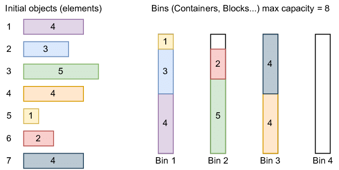
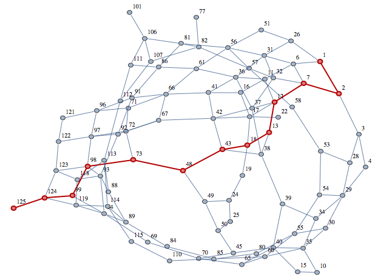
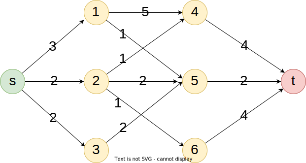

# Algoritmos de Otimização Combinatória em Grafos

Neste módulo, vamos estudar alguns algoritmos de otimização combinatória em grafos para os problema estudados no módulo anterior.


---

# Problema da Mochila

Dados um **conjunto de itens**, cada um com um **peso** e um **valor**, e uma mochila com **capacidade máxima**, o problema da mochila consiste em selecionar itens para **maximizar o valor total**, **sem exceder a capacidade** da mochila.


---

## Anedota 

* Imagine que  você encontrou um **gênio** na caverna que pode resolver o problema da mochila para você.
* Você mostra que tem **4 itens** e para decidir quais itens levar.
* O gênio diz que infelizmente só pode resolver o problema para 3 itens.
* O que você faz?


---

* **Divide** o problema em dois problemas com 3 itens:
  1. Assumo que **vou levar** um determinado item. Resulta um problema com os demais itens e **capacidade reduzida**.
  2. Assumo que **não vou levar** o item. Resulta um problema com os demais itens e **capacidade original**.
* Quando o gênio resolver esses dois problemas, você **escolhe a melhor solução**.


---

* O gênio diz que se enganou e pode resolver o problema apenas para 2 itens.
* O que você faz?
* Divide cada um dos dois subproblemas em dois subproblemas com 2 itens, usando a mesma lógica.
* Você já percebeu onde isso vai dar, certo?

---


---

### Moral da história

* Quando você dividir o problema até restar só um item, você **sabe a resposta**.
  * Se couber na mochila, você leva.
  * Se não couber, você não leva.
* Você **não precisa** do gênio para resolver o problema.
* Essa é uma estratégia chamada **dividir para conquistar**.
  * Divide o problema em subproblemas menores.
  * Resolve os subproblemas.
  * Combina as soluções dos subproblemas para resolver o problema original.
  * Essa estratégia pode ser ou não eficiente, dependendo da **altura da árvore** de recursão e do custo de **combinar as soluções**.

---

## Formalizando
- Sejam:
  - $M(I,W)$ a função que resolve o problema da mochila para uma lista de itens $I$ e capacidade $W$.
  - $w_i$ o peso do item $i$.
  - $v_i$ o valor do item $i$.
  - $I/\{1\}$ a lista de itens $I$ sem seu primeiro elemento.
  - $\sharp I$ o número de elementos na lista $I$.

$$
M(I, W) = \left\{ \begin{array}{ll}
0    & \text{se } W \leq 0 \text{ ou }  \sharp I = 0 \\
M(I / \{1\}, W) & \text{se } w_1 > W \\
\max \{ M(I / \{1\}, W), M(I / \{1\}, W - w_1) +v_1 \} & \text{caso contrário} 

\end{array} \right.
$$

---

## Implementação

```python
def knapsack_rec(itens:list, W:int)->tuple:
# anchor cases
    if W <= 0 or len(itens) == 0:
        return ([], 0)
    # recursive cases
    if itens[0]['w'] > W:  # first item is too heavy
        return knapsack_rec(itens[1:], W)
    else:  # first item can be taken or not
        # solve assuming the item is taken
        taken, value = knapsack_rec(itens[1:], W-itens[0]['w'])
        value += itens[0]['v']  # add the value of the item
        # solve assuming the item is not taken
        not_taken, value2 = knapsack_rec(itens[1:], W)
        # return the best solution
        if value > value2:
            return (taken + [itens[0]], value)
        return (not_taken, value2)
```

---

## Complexidade

Observando a árvore de recursão, 
- percebemos que cada nó tem dois filhos, exceto os nós folha.
- a altura da árvore é $n$, já que a cada nível removemos um item.
- portanto, o número de nós é $2^n -1$.	

Observando o algoritmo de combinação de soluções,
- percebemos que é de tempo constante, ou seja, $O(1)$.

Como realizamos uma operação de tempo constante em cada nó, a complexidade do algoritmo é $O(2^n)$ no pior caso.

---

## Programação Dinâmica

Antes de prosseguir, com a definição e caracterização da programação dinâmica, vamos observar o comportamento do algoritmo recursivo.

---

## Análise do Algoritmo Recursivo

- As chamadas recursivas se empilham até o nível mais baixo da árvore.
- Ali, o algoritmo resolve realmente alguma coisa.
- Ele resolver o problema de **encaixar um único item** na mochila para **todas as capacidades** possíveis.
- A partir daí, ele começa a desempilhar as chamadas, **combinando as soluções** dos subproblemas.
- Ele passa a tentar encaixar o segundo item na mochila para todas as capacidades, levando em consideração a solução do primeiro item.
- E assim por diante, até resolver o problema original.

---

## E se ...

- deixarmos de lado a recursão e resolvermos os subproblemas de **baixo para cima**?
- começando com um **único item** e **todas as capacidades** possíveis.
- e depois tentar encaixar o **segundo item**, levando em consideração a **solução do primeiro** item.
- e assim por diante, até resolver o problema original?

--- 

## Implementação em Python (Didática)

```python
def knapsack_pd(itens: list, W: int) -> tuple:
    n = len(itens)  # number of itens
    M = [[0 for _ in range(W+1)] for _ in range(n+1)]  # matrix to store the values
    # fill first row with trivial case
    w0, v0 = itens[0]['w'], itens[0]['v']
    for w in range(w0, W+1):
        M[0][w] = v0
    # fill the rest of the matrix using formula M[i][w] = max(M[i-1][w], M[i-1][w-wi] + vi)
    for i in range(1, n):
        wi, vi = itens[i]['w'], itens[i]['v']  # value of the item
        M[i][:wi] = M[i-1][:wi]  # best value for weight w < wi is the same as the previous row
        for w in range(wi, W+1):
            M[i][w] = max(M[i-1][w], M[i-1][w-wi] + vi)
    # build the list of itens taken
    taken = []
    i = n-1
    w = W
    while i > 0:
        if M[i][w] != M[i-1][w]:
            taken.append(itens[i])
            w -= itens[i]['w']
        i -= 1
    if M[i][w] != 0: taken.append(itens[i])
    return taken, M[n-1][W]
```

---

## Implementação em Python ( numpy )

```python
def knapsack_pd_numpy(itens: list, W: int) -> tuple:
    n = len(itens)
    M = np.zeros(W + 1, dtype=int) # array to store the values
    keep = np.zeros((n, W + 1), dtype=bool) # array to store the items taken
    M_shifted = np.zeros(W + 1, dtype=int) # auxiliary array to store shifted values
    for i in range(n):
        wi, vi = itens[i]['w'], itens[i]['v']
        if wi <= W:
            # Shift the M array to the right by wi positions and add vi
            M_shifted[:] = 0 #  reset the array
            M_shifted[wi:] = M[:-wi] + vi # shift the array and add the value
            # Determine whether including the current item offers a better value
            new_M = np.maximum(M, M_shifted) # recursive formula is applied here
            # Keep track of items included
            keep[i] = M_shifted > M
            M = new_M
    # Reconstruct the list of items taken
    w = W
    taken = []
    for i in range(n - 1, -1, -1):
        if keep[i, w]:
            taken.append(itens[i])
            w -= itens[i]['w']
    return taken, M[W]
```

---

## Complexidade

- O algoritmo de programação dinâmica tem complexidade $O(nW)$.
- **Não** é considerado **polinomial** no sentido estrito da Teoria da Complexidade Computacional, mesmo sendo **eficiente** em muitos **casos práticos**.
- Isso ocorre porque a quantidade de **bits** necessária para representar o valor de $W$ é proporcional a $\log W$.
- A complexidade do algoritmo é, portanto, $O(n2^{\log W}) = O(nW)$.
- No mundo real, ninguém resolve um *knapscak* para grãos de areia em um navio cargueiro. Ou seja $W$ é **limitado**.

---
## Programação Dinâmica

- Técnica de **resolução de problemas** complexos por **divisão** em subproblemas menores, **reutilizando** soluções previamente calculadas para **evitar redundância**.
- **Richard Bellman** (década de 1950)
  - Desenvolveu a técnica para resolver problemas de decisão sequencial para otimização militar e controle de sistemas dinâmicos.
- Origem do Termo
  - **Programação:** Planejamento de processos (não relacionado a computadores na época).
  - **Dinâmica:** Refere-se a processos que evoluem ao longo do tempo.
- É uma técnica muito poderosa e versátil, com aplicações em diversas áreas da computação moderna.

---

### Características da Programação Dinâmica

#### 1. Subproblemas sobrepostos
- Problemas são decompostos em subproblemas menores.
- **Exemplos:** 
  - Fibonacci, onde $F(n) = F(n-1) + F(n-2)$.
  - Problema da mochila, onde $M(I, W) = \max \{ M(I/\{1\}, W), M(I/\{1\}, W-w_1) + v_1 \}$.
  - Caminho mínimo em grafos, onde $D(i,j) = \min \{ D(i,k) + D(k,j) \}$.

---

#### 2. Memoização

*Memoização* é uma técnica de **armazenamento** de soluções previamente calculadas para **evitar recomputação**.

- **Exemplos:** 
  - Fibonacci, onde armazenamos o valor de $F(n)$ em uma lista.
  - Problema da mochila, onde armazenamos o valor de $M(I, W)$ em uma matriz.
  - Caminho mínimo em grafos, onde armazenamos o valor de $D(i,j)$ em uma matriz.

---

#### 3. Tabela de Solução (*Bottom-Up*)
- Resolve subproblemas iterativamente.
- Preenche uma tabela com as soluções intermediárias.
- ***Bottom-up*** se refere a árvore de recursão, que é resolvida de forma implícita de baixo para cima, das folhas para a raiz.

<br>

> Obs.: As árvores da computação são representadas de cabeça para baixo por convenção e praticidade.

---

### 4. Subestrutura Ótima

- A solução ótima para um problema é construída a partir de soluções ótimas de seus subproblemas.
- Nem todos os problemas possuem subestrutura ótima. Por exemplo, o TSP, saber a melhor rota entre $n$ cidades não ajuda muito a saber a melhor rota entre $n+1$ cidades.
   

---

### 5. Complexidade Controlada
- Resolve problemas evitavelmente exponenciais ao calcular cada subproblema apenas uma vez.

---

### 6. Aplicações
- Problemas clássicos:
  - Mochila.
  - Cadeias de matrizes.
  - Caminhos mínimos em grafos (Floyd-Warshall).
  - Subsequência comum máxima (LCS).

---

## Empacotamento <br>(*bin packing*)

Dado um **conjunto de itens** e um conjunto de pacotes (*bins*) com **tamanhos fixos**, 
o problema de empacotamento consiste em distribuir os itens nos pacotes de forma a **minimizar o número de pacotes utilizados**.

Do ponto de vista do corte, o problema consiste em **cortar** um **material** em **peças menores** de forma a **minimizar o desperdício**.




---

### Algoritmos 

- **Não** existe um algoritmo **polinomial** para o problema de empacotamento que garanta a solução ótima.
- Veremos neste módulo alguns algoritmos **heurísticos** para o problema de empacotamento.
  - **First Fit**.
  - **Next Fit**.
  - **Best Fit**.
  - **Worst Fit**.
  - **Local Search**.

---

#### *First Fit Decreasing*

1. Ordena os itens em ordem decrescente de tamanho.
2. Para cada item, tenta encaixá-lo no **primeiro pacote que encontrar**.
3. Se não couber em nenhum pacote, cria um novo pacote.

- **Complexidade:** $O(n^2)$.

---

#### *Next Fit Decreasing*

1. Ordena os itens em ordem decrescente de tamanho.
2. Para cada item, tenta encaixá-lo no **último pacote** criado.
3. Se não couber, cria um novo pacote.

- **Complexidade:** $O(n)$.
- Mais usados como *decoder* de algoritmos de empacotamento.

 
---

#### *Best Fit Decreasing*

1. Ordena os itens em ordem decrescente de tamanho.
2. Para cada item, tenta encaixá-lo no pacote que **melhor** se ajusta ao seu tamanho.
3. Se não couber em nenhum pacote, cria um novo pacote.

- **Complexidade:** $O(n^2)$.
- *Melhor* significa o pacote com **menor espaço livre** após a inserção.
- O objetivo é **minimizar o desperdício**.

---

#### *Worst Fit Decreasing*

1. Ordena os itens em ordem decrescente de tamanho.
2. Para cada item, tenta encaixá-lo no pacote com **maior espaço livre**.
3. Se não couber, cria um novo pacote.

- **Complexidade:** $O(n^2)$.
- *Pior* significa o pacote com **maior espaço livre** após a inserção.
- O objetivo é **facilitar futuras inserções**.


---

#### *Local Search*

Busca local é uma estratégia de otimização que **explora** o espaço de soluções a partir de uma solução inicial, **modificando** iterativamente a solução para **melhorar** o valor da **função objetivo**.

- **Vizinhança:** Conjunto de soluções que podem ser obtidas a partir de uma solução dada, geralmente por **pequenas modificações**.

---

#### *Local Search* Algoritmo

1. **Inicialização:** Gera uma solução inicial, solução corrente.
2. **Vizinhança:** Gera um conjunto de soluções vizinhas da solução corrente.
3. **Seleção:** Escolha um vizinho que melhore a solução corrente como nova solução corrente e vá para o **passo 2**.
4. **Critério de Parada:** Senão houver solução melhor na vizinhança, termina.

<br>

> O passo 3 pode tomar o **melhor vizinho** ou o **primeiro vizinho** encontrado que melhore a solução atual.

---

#### *Local Search* para Empacotamento

A Implementação da busca local para o problema de empacotamento apresenta alguns complicadores:

- A **função objetivo** é muito pouco *sensível* a pequenas modificações.
- Troca pares de itens entre pacote não afeta a função objetivo.
- Esvaziar um pacote e redistribuir os itens não é uma operação trivial.

Por isso, vamos implementar **duas versões**.
1. **F.O. Original:** Minimizar o número de pacotes.
2. **F.O. Alternativa:** Maximizar a variância da carga dos pacotes.


---

# Cobertura de Conjuntos (*Set Cover*)

Dado um **conjunto de elementos** e um **conjunto de subconjuntos**, o problema de cobertura de conjuntos consiste em **selecionar o menor número de subconjuntos** de forma a **cobrir todos os elementos**.


---

Assim como o *bin packing*, o problema de cobertura de conjuntos é **NP-difícil**. Ou seja, devemos utilizar métodos **heurísticos** para encontrar soluções em tempo **razoável**.

---

## Algoritmo Guloso (*Greedy*)

- Constroi uma solução iterativamente, tmando uma escolha a cada passo que parece ser a melhor no momento.
- Uma vez tomada uma decisão, ela não será mais alterada (*straigthforward*).
- As decições são baseadas em um critério heurístico.
  - **Set Cover:** Escolhe o subconjunto que cobre o maior número de elementos ainda não cobertos.
  - Se o problema for ponderado, escolhe o subconjunto com o menor custo dividido pelo número de elementos não cobertos.

---

### Implementação em Python

```python
# TODO
```

---

## *Greedy Randomized Adaptive Search Procedure* (*GRASP*)

- GRASP é uma meta-heurística que foca na construção de boas soluções aleatórias e na busca local para melhorar essas soluções.
- Podemos implementar um GRASP apenas alterando o critério de escolha do subconjunto no algoritmo guloso.
- A escolha é feita de forma aleatória, com maior probabilidade para os subconjuntos com melhor avaliação.
  - Roleta viciada.
    - Probabilidade proporcional ao ranque.
    - Probabilidade proporcional à avaliação.
  - Lista restrita de candidatos.

---

### Implementação em Python

```python
# TODO
```

---

## *Large Neighborhood Search* (*LNS*)

- LNS é uma meta-heurística que foca na busca local, mas com uma estratégia diferente.
- A solução corrente é parcialmente destruída e reconstruída.
- Podemos implementar um LNS removendo, de forma aleatória, alguns subconjuntos da solução corrente e reconstruindo a solução a partir dos elementos não cobertos.

---

### Implementação em Python

```python
# TODO
```

---

## Problema do Caixeiro Viajante <br>(*traveling salesman problem - TSP*)

Dado um **conjunto de cidades** e as **distâncias** entre elas, o problema do caixeiro viajante consiste em encontrar a **rota mais curta** que **visite todas as cidades uma vez** e retorne à cidade de origem.

O problema é **NP-Completo**, o que significa que não existe um algoritmo eficiente para resolvê-lo em tempo polinomial.


---

### Algoritmos

**Não** há um algoritmo **polinomial** para o TSP. No entanto, existem **inúmeros** algoritmos **heurísticos** propostos para encontrar soluções aproximadas.

Neste curso vamos abordar os seguintes algoritmos:
- Construtivos:
  - **Nearest Neighbor**.
  - **(Farthest) Insertion**.
- Busca Local:
  - **2-Opt**.
  - **Or-Opt**
- Meta-heurísticas:
  - **Variable Neighborhood Descent**.

---

### Algoritmo do Vizinho Mais Próximo (*Nearest Neighbor*)

1. **Inicialização:** Escolhe uma cidade qualquer como origem.
2. **Seleção:** Para cada cidade, escolhe a cidade mais próxima que ainda não foi visitada.
3. **Critério de Parada:** Todas as cidades foram visitadas.

<br>

> **Complexidade:** $O(n^2)$.
> Resultados **dependem** da cidade de origem.
> Geralmente, é a abordagem mais simples/intuitiva para o TSP.

---

### Implementação em Python

```python
def nearest_neighbor(c:np.ndarray)->list:
    n = len(c) # number of cities
    unvisited = set(range(1,n)) # set of unvisited cities (all except 0)
    tour = [0] # start at city 0
    current = 0 # current city
    while unvisited:
        # witch unvisited city is the nearest?
        next = min(unvisited, key=lambda j: c[current,j])
        unvisited.remove(next) # remove from unvisited set
        tour.append(next) # add to the tour
        current = next # move to the next city
    # tour.append(0)
    return tour
```

---

### Algoritmo da Inserção (*Insertion*)

Dada uma ordem de inclusão das cidades, o algoritmo da inserção consiste em **inserir** cada cidade na **melhor posição** da rota atual.

1. **Inicialização:** Crie um ciclo com as três primeiras cidades.
2. **Seleção:** Para cada cidade, insira-a na melhor posição da rota atual.
3. **Critério de Parada:** Todas as cidades foram visitadas.

<br>

> **Complexidade:** $O(n^2)$.
> Resultados **dependem** da ordem de inclusão das cidades.
> Soluções **melhores** que o *Nearest Neighbor*.

---

### Implementação em Python

```python
def insertion(c:np.ndarray, ins_order:list)->list:
    n = len(c) # number of cities
    tour = ins_order[:3] # start with the first 3 cities
    for i in ins_order[3:]: # insert the remaining cities
        # find the best place to insert city i
        min_cost = np.inf
        for j in range(1, len(tour)):
            # cost of inserting i between j-1 and j
            cost = c[tour[j-1],i] + c[i,tour[j]] - c[tour[j-1],tour[j]]
            if cost < min_cost:
                min_cost = cost
                min_idx = j                
        if c[tour[-1],i] + c[i,tour[0]] - c[tour[-1],tour[0]] < min_cost:
            # better to insert at the end
            tour.append(i)
        else:
            tour.insert(min_idx, i)
        if points is not None:
            plot_tour(points, tour)
    return tour
```

---

### *Furthest Insertion*

Se trata de uma variação do algoritmo da inserção que **insere** a cidade mais **distante** da rota atual.

Construção da **ordem de inclusão**:
1. **Inicialização:** A primeira e segunda cidades são as mais distantes.
2. **Seleção:** A próxima cidade é que apresenta a maior distância para a cidade mais próxima já incluída.
3. **Critério de Parada:** Todas as cidades foram selecionadas.

Uma vez que a ordem de inclusão é definida, o algoritmo da inserção é aplicado.

> **Complexidade:** $O(n^2)$.
> Pode haver outra ordenação que resulte em uma solução melhor.
---

### Implementação em Python

```python
def furthest_order(c:np.ndarray)->list:
    n = len(c) # number of cities
    i,j = np.unravel_index(c.argmax(), c.shape) # find the furthest pair
    order = [i,j] # start with the furthest pair
    dist = np.minimum(c[i], c[j]) # dist[i] is the distance from i to the nearest city in the tour
    dist[i] = dist[j] = -1 # sinalize that i and j are already in the tour
    for _ in range(n-2): # add the remaining cities
        k = np.argmax(dist) # find the furthest city 
        order.append(k) # add to the list
        dist = np.minimum(dist, c[k]) # update the distances
        dist[k] = -1 # sinalize that k is already in the tour
    return order

# Furthest Insertion
order = furthest_order(c)
tour = insertion(c, order)

```

---

### *2-Opt*

O 2-Opt é uma vizinhança de troca de arestas que consiste em **remover** duas arestas da rota e **reconectar** as cidades de forma a **reduzir** o comprimento da rota.

> **Complexidade:** $O(n^2)$.


---

### Implementação em Python

```python
def two_opt(c:np.ndarray, tour:list)->bool:
    n = len(c) # number of cities
    for i in range(n):
        for j in range(i+2, n-(i==0)): # i+2 to avoid adjacent edges and n-1 if i==0
            delta = c[tour[i],tour[j]] + c[tour[i+1],tour[(j+1)%n]] \
                    -c[tour[i],tour[i+1]] - c[tour[j],tour[(j+1)%n]]
            if delta < -1e-6:
                if j == n-1:
                    tour[i+1:] = tour[i+1:][::-1]
                else:
                    tour[i+1:j+1] = tour[j:i:-1]
                return True
    return False
```

---

### *Or-Opt*

O Or-Opt é uma vizinhança de deslocamento que consiste em **remover** um conjunto de cidades da rota e **reinserir** em uma nova posição.


> **Complexidade:** $O(n^2)$.


---


### Implementação em Python ( desloca uma única cidade )

```python
def or_opt(c:np.ndarray, tour:list)->bool:
    n = len(c) # number of cities
    for i in range(n): # try to move each city
        # calculate the cost of removing i 
        rem_delta =  c[tour[i-1],tour[(i+1)%n]] \
                    -c[tour[i-1],tour[i]] - c[tour[i],tour[(i+1)%n]]
        for j in range(n): # try to insert i in each position 
            if j in (i, post_i): continue # skip i, i-1 and i+1 
            # calculate the cost of adding i in position j
            add_delta = -c[tour[j-1],tour[j]] \
                        +c[tour[j-1],tour[i]] + c[tour[i],tour[j]]
            if add_delta + rem_delta < -1e-6: # if the move is improving
                if i < j: # first remove i, then insert it in position j                    
                    tour.insert(j, tour[i])
                    tour.pop(i)
                else:# first insert i in position j, then remove the original i                    
                    vi = tour.pop(i)
                    tour.insert(j, vi)
                return True 
    return False
```
> Obs.: Em Python `tour[-1]` é o último elemento da lista.

<!-- _footer: '' -->

---

### Outras Vizinhanças

Para citar algumas outras vizinhanças comuns:
- **swap:** Troca a posição de duas cidades.
- **3-Opt:** Vizinhança de troca de 3 arestas.
- **4-Opt:** Vizinhança de troca de 4 arestas.
- **k-Opt:** Vizinhança de troca de k arestas.
- **Lin-Kernighan:** Inversão **recursiva** de sub-rotas.

---

### *Variable Neighborhood Descent* (*VND*)

O VND é uma meta-heurística que combina **múltiplas vizinhanças** para explorar o espaço de soluções.

1. **Inicialização:** Gera uma solução inicial.
2. **Vizinhança:** Aplica uma sequência de vizinhanças até encontrar uma solução melhor.
3. **Critério de Parada:** Não há mais soluções melhores em qualquer vizinhança.


<br>

- A performance do VND depende da **qualidade**, **diversidade** e **ordem** das vizinhanças.
- Pode ser usado como método de descida em combinação com outras meta-heurísticas.

---

### Implementação em Python

```python
def VND(c:np.ndarray, tour:list, points:np.ndarray = None)->None:
    # list of neighborhoods
    neighborhoods = [two_opt, or_opt]
    while True:
        for neighborhood in neighborhoods:
            if neighborhood(c, tour):
                if __debug__: # print the cost for debug only
                    print("VND, ", neighborhood.__name__, cost(c, tour))
                break # go back to the first neighborhood
        else: # if no improving move was found in any neighborhood
            break # stop the search
```

---


## Árvore Geradora Mínima <br> (*minimum spanning tree - MST*)

Dado um **grafo conexo** e **ponderado**, o problema da árvore geradora mínima consiste em encontrar a **árvore** que conecta todos os vértices com o **menor custo total**.

 

<br>

> Árvore na teoria dos grafos é um subgrafo **conexo** e **acíclico**.

---

### Algoritmos 

O MST é um problema que permite a aplicação de algoritmos **gulosos** para encontrar a solução **ótima** em tempo **polinomial**.

Os algoritmos mais conhecidos são:

- **Kruskal**.
- **Prim**.

---

### Algoritmo de Kruskal

1. **Ordena** as **arestas** do grafo em ordem **crescente** de peso.
2. Para cada aresta, se ela **não** forma um **ciclo** com as arestas já selecionadas, **adiciona** a árvore.
3. Repete o passo 2 até que a árvore tenha $n-1$ arestas. 


---

### Implementação em Python

```python
def Kruskal(c:np.ndarray, edges:list = None) -> list:
    n = len(c)   
    if edges is None: # complete graph
        edges = [(i, j) for i in range(n) for j in range(i)]       
    edges.sort(key=lambda x: c[x[0], x[1]])    
    parent = list(range(n))
    def find(u): # find the root of the component of u
        if parent[u] != u: # u is not the root
            parent[u] = find(parent[u]) # path compression
        return parent[u]
    arcs = []
    for u, v in edges: # iterate over the edges 
        pu, pv = find(u), find(v) # find the roots of the components
        if pu != pv: # u and v are in different components
            arcs.append((u, v)) # add the edge to the tree
            parent[pu] = pv # merge the components
    return arcs
```

---

### Algoritmo de Prim

1. **Inicializa** a árvore com um vértice qualquer.
2. **Enquanto** a árvore não contiver todos os vértices:
   - **Escolhe** a aresta de menor peso que conecta um vértice da árvore a um vértice fora da árvore.
   - **Adiciona** a aresta e o vértice à árvore.

---

### Implementação em Python

```python
def Prim(c:np.ndarray,edges:list = None)->list:
    n = len(c) # number of vertices
   if edges is not None: # not a complete graph
        idx_i,idx_j = zip(*edges) # unzip the edges
        c_ = np.full((n, n), np.inf) # create a new cost matrix with inf values
        c_[idx_i, idx_j] = c[idx_i, idx_j] # copy the weights from the original graph
        c = c_ # replace the original graph        
    closest_in_tree = np.zeros(n, dtype=int) # closest vertex in the tree
    min_dist = c[0] # minimum distance to the tree
    non_tree = set(range(1, n)) # set of vertices not in the tree
    arcs = [] # list of arcs in the tree
    while non_tree: # while there are vertices outside the tree
        u = min(non_tree, key=lambda x: min_dist[x]) # find the closest vertex
        non_tree.remove(u) # remove from the set
        v = closest_in_tree[u] # find the closest vertex in the tree
        arcs.append((u, v)) # add the edge to the tree
        for w in non_tree: # update min_dist and closest_in_tree
            if c[u, w] < min_dist[w]:
                min_dist[w] = c[u, w]
                closest_in_tree[w] = u
    return arcs
```

<!-- _footer: '' -->

---

## Caminho Mínimo <br> (*shortest path*)

Dado um **grafo** com **arestas ponderadas** e um **vértice de origem**, o problema do caminho mínimo consiste em encontrar o **caminho de menor custo** entre o vértice de origem e todos os outros vértices ou um vértice de destino.



---

### Algoritmos

O problema do caminho mínimo é um dos problemas mais estudados na teoria dos grafos e possui **diversos algoritmos** para sua resolução.

Os algoritmos mais conhecidos são:

- **Dijkstra**.
- **Bellman-Ford**.
- **Floyd-Warshall**.

---

### Algoritmo de Dijkstra

Para pesos **não negativos**, o algoritmo de Dijkstra é uma solução **eficiente** para o problema do caminho mínimo.

1. **Inicializa** a distância do vértice de origem como zero e dos demais vértices como infinito.
2. **Enquanto** houver vértices não visitados:
   - **Escolhe** o vértice não visitado mais próximo do vértice de origem.
   - **Atualiza** as distâncias dos vértices adjacentes ao vértice escolhido.
   - **Marca** o vértice como visitado.
   - **Repete** até que todos os vértices tenham sido visitados.
3. **Retorna** as distâncias mínimas.

---

### Implementação em Python

```python
from heapq import heappush as push, heappop as pop
def Dijkstra(adj:dict, s:int, t:int) -> tuple:
    n = len(adj) # number of nodes
    dist = [np.inf]*n # known shortest distance from source to i
    dist[s] = 0 # distance from source to itself is 0
    prev = [-1]*n # previous node in the shortest path 
    heap = [(0, s)] # (distance, node) pairs to be explored
    while heap: # while there are nodes to be explored
        c_si, i = pop(heap) # get the node with the smallest distance
        if i == t: break # target node reached
        if c_si > dist[i]: continue # skip this node, it has already been explored
        for j, c_ij in adj[i]: # for each neighbor j of i
            if dist[j] > c_si + c_ij: # if the distance from source to j is shorter via i
                dist[j] = c_si + c_ij # update the distance
                prev[j] = i # update the previous node in the shortest path
                push(heap, (dist[j], j)) # add j to the nodes to be explored
    if i != t: # target node is not reachable
        raise ValueError("Target node is not reachable")
    path = [t] # reconstruct the shortest path from target to source
    while path[-1] != s: path.append(prev[path[-1]])
    return dist[t], path[::-1] # return the shortest distance and the path in reverse order
```

<!-- _footer: '' -->
---

### Algoritmo de Bellman-Ford
 Resolve o problema do caminho mínimo para grafos direcionados, mesmo na presença de pesos **negativos**. Também detecta **ciclos negativos**.

1. **Inicializa** a distância do vértice de origem como zero e dos demais vértices como infinito.
2. **Relaxa** as arestas $|V|-1$ vezes.
3. **Verifica** se há ciclos negativos.
4. **Retorna** as distâncias mínimas.

---

#### Relaxamento de Arestas

O relaxamento de uma aresta $(u,v)$ consiste em **atualizar** a distância de $v$ se a distância de $u$ somada ao peso da aresta for menor que a distância atual de $v$.

$$
\text{dist}[v] = \min(\text{dist}[v], \text{dist}[u] + \text{peso}(u,v))
$$

Ao mesmo tempo, atualizamos o **vértice anterior** de $v$ para $u$ para posterior reconstrução do caminho se necessário.

$$
\text{prev}[v] = u
$$

<br>

> O relaxamento nada mais é do quer se perguntar ***"é melhor chegar em $v$ passando por $u$?"***.

---

#### Verificação de Ciclos Negativos

- Para verificar a presença de ciclos negativos, basta **relaxar** todas as arestas mais uma vez.

- Se alguma distância for **atualizada**, então há um ciclo negativo, pois a distância mínima não deveria mudar após $|V|-1$ relaxamentos.


---

### Implementação em Python

```python
def Bellman_Ford(adj:dict, s:int, t:int) -> tuple:
    n = len(adj) # number of nodes
    dist = [np.inf]*n # known shortest distance from source to i
    dist[s] = 0 # distance from source to itself is 0
    prev = [-1]*n # previous node in the shortest path
    for k in range(n): # repeat n times
        flag = False # flag to check if the distance is updated
        for i in range(n): # for each node i
            for j, c_ij in adj[i]: # for each neighbor j of i
                if dist[j] > dist[i] + c_ij: # Relaxation
                    flag = True # distance is updated
                    dist[j] = dist[i] + c_ij # update the distance
                    prev[j] = i # update the previous node in the shortest path
                    if k == n-1: raise ValueError("Negative cycle detected")
        if not flag: break # if no distance is updated, the algorithm is converged
    if dist[t] == np.inf: raise ValueError("Target node is not reachable")
    path = [t] # reconstruct the shortest path from target to source
    while path[-1] != s:
        path.append(prev[path[-1]])
    return dist[t], path[::-1] # return the shortest distance and the path in reverse order
```

<!-- _footer: '' -->

---

### Algoritmo de Floyd-Warshall

O algoritmo de Floyd-Warshall é uma solução **eficiente** para o problema do caminho mínimo em **grafos densos** **sem ciclos negativos**.

1. **Inicializa** a matriz de distâncias com os pesos das arestas.
2. **Para** cada vértice $k$ (intermediário):
   - **Para** cada par de vértices $i$ e $j$:
     - **Atualiza** a distância de $i$ a $j$ passando por $k$ se for menor que a distância atual.
     - **Atualiza** o vértice anterior de $j$ para $k$ se a distância for atualizada.
3. **Retorna** a matriz de distâncias e a matriz de vértices anteriores.

> A partir da matriz de vértices anteriores, é possível **reconstruir** o caminho mínimo entre qualquer par de vértices.  

---

### Implementação em Python

```python
def Floyd_Warshall(adj: dict) -> np.ndarray:
    n = len(adj)  # number of nodes
    dist = np.full((n, n), np.inf)  # known shortest distance from i to j
    nxt = np.full((n, n), -1, dtype=int)  # intermediate node in the shortest path from i to j 
    np.fill_diagonal(dist, 0)  # distance from i to itself is 0
    for i in adj:  # for each node i
        for j, c_ij in adj[i]:  # for each neighbor j of i
            dist[i, j] = c_ij  # update the distance from i to j
            nxt[i, j] = j  # update the intermediate node in the shortest path
    for k in range(n):  # for each intermediate node k
        for i in range(n):  # for each node i
            for j in range(n):  # for each node j
                if dist[i, j] > dist[i, k] + dist[k, j]:  # Relaxation
                    dist[i, j] = dist[i, k] + dist[k, j]  # update the distance from i to j
                    nxt[i, j] = nxt[i, k] # update the intermediate node in the shortest path
    return dist, nxt  # return the shortest distance matrix and the intermediate node matrix

```

<!-- _footer: '' -->

---

```python
def Floyd_Warshall_path(nxt: np.ndarray, s: int, t: int) -> list:
    nxt = nxt[:,t]  # get matrix column for target node
    path = [s]  # reconstruct the shortest path from s to t
    while path[-1] != t:
        if nxt[path[-1]] == -1:  # target node is not reachable
            raise ValueError("Target node is not reachable")
        path.append(nxt[path[-1]])
    return path  # return the shortest path from s to t
```

---

## Fluxo Máximo <br> (*maximum flow*)

Dado um **grafo** com **capacidades** nas arestas e dois vértices especiais, o problema do fluxo máximo consiste em encontrar o **fluxo máximo** que pode ser enviado do vértice de **origem** ao vértice de **destino**, determinando a quantidade de fluxo que passa por cada aresta.


---


### Algoritmos

O problema do fluxo máximo é um dos problemas mais estudados na teoria dos grafos e possui **diversos algoritmos** para sua resolução.

Os algoritmos mais conhecidos são:  

- **Ford-Fulkerson**.
  - **Edmonds-Karp**.
- **Push-Relabel**.

---

### Algoritmo de Ford-Fulkerson

O algoritmo de Ford-Fulkerson é uma solução **genérica** para o problema do fluxo máximo que utiliza um **caminho aumentante** para aumentar o fluxo.

1. **Inicializa** o fluxo em todas as arestas como zero.
2. **Enquanto** houver um caminho aumentante:
   - **Encontra** um caminho aumentante.
   - **Atualiza** o fluxo das arestas no caminho.
3. **Retorna** o fluxo máximo.

---

#### Caminho Aumentante

Um caminho aumentante é um caminho do vértice de origem ao vértice de destino que ainda não está *saturado*.

Usamos o algoritmo de **DFS** para encontrar um caminho aumentante.

<br>

> **Saturado:** Quando o fluxo na aresta atinge a capacidade máxima.
 


---

#### Grafo residual

Se aplicarmos o algoritmo diretamente no grafo de entrada, podemos não encontra a solução ótima.



---

Observe que não há mais caminhos aumentantes no grafo original, mas ainda não atingimos o fluxo máximo.


> Se pudessemos nos *arrepender* do fluxo `2->5` ...

---

Para que o algoritmo de Ford-Fulkerson funcione, é necessário que sejamos capazes de nos *arrepender* de um fluxo que já foi enviado.

Isso foi conseguido, de forma muito elegante, através do **grafo residual**.


---

#### Grafo Residual

- Para cada aresta $(u,v)$ no grafo original, o grafo residual possui duas arestas:
  - Uma aresta $(u,v)$ com capacidade igual à **capacidade original**,
  - Se **não houver** $(v,u)$ no grafo original, uma aresta $(v,u)$ com capacidade igual a **zero** se $u \neq s$ e $v \neq t$.
- Quando enviamos um fluxo de $u$ para $v$,
  -  **somamos** o fluxo na aresta $(u,v)$,
  -  **subtraímos** o fluxo na aresta $(v,u)$, mesmo resultando em um valor negativo.
- e.g. se a capacidade de $(v,u)$ é 0 e o fluxo resultante é -5, então $(u,v)$ não está saturada, pois $0 - (-5) = 5$.
- Sem saber, o DFS consegue se *arrepender* de um fluxo que já foi enviado por $(u,v)$, atravessando a aresta $(v,u)$ no grafo residual.

<!-- _footer: '' -->

---

#### <!--fit--> Grafo Residual


 


---

### Implementação em Python

```python
def Ford_Fulkerson(adj: list, s: int, t: int) -> tuple:
    n = len(adj)  # number of nodes
    capacity, flow = residual_graph_n_flow(adj)  # expanded graph and flow values
    MAX = max(capacity[s].values())  # big number
    max_flow = 0 # total flow value
    while True:
        path = DFS(capacity, flow, s, t)  # find an augmenting path
        if not path: break # no more augmenting paths        
        bn = MAX  # bottleneck
        for i in range(len(path)-1):
            bn = min(bn, capacity[path[i]][path[i+1]] - flow[path[i], path[i+1]])
        # update flow values for the augmenting path
        for i in range(len(path)-1):
            flow[path[i], path[i+1]] += bn  # forward flow
            flow[path[i+1], path[i]] -= bn  # reverse flow
        max_flow += bn  # update total flow value
    # return the flow values and the maximum flow
    flow = {k: v for k, v in flow.items() if v > 0} # remove zero flows
    return flow, max_flow
```

<!-- _footer: '' -->

---

#### Implementação de Funções Auxiliares

##### Grafo Residual

Esta função cria o grafo residual a partir do grafo original, bem como o dicionário de fluxo.

Será utilizado pelos algoritmos de Ford-Fulkerson, Edmonds-Karp e Push-Relabel.

```python
def residual_graph_n_flow(graph):
    n = len(graph)  # number of nodes
    flow = {(i, j): 0 for i in range(n) for j in graph[i]}  # flow values
    flow.update({(j, i): 0 for i in range(n) for j in graph[i]})  # add reverse flow values
    residual_graph = deepcopy(graph)  # copy the graph
    # add reverse edges with zero capacity
    for i, j in flow:
        if i != t and j not in graph[i]:
            residual_graph[i][j] = 0
    return residual_graph, flow
```


---

##### DFS

Encontra um caminho aumentante no grafo residual.

```python
def DFS(capacity: dict, flow: dict, s: int, t: int) -> list:
    stack = [s]  # stack of nodes to visit
    prev = [-1]*n # previous node in the path, -1 means not visited
    while stack:
        if prev[t] != -1:  # target node reached
            # reconstruct the path from target to source
            path = [t]
            while prev[path[-1]] != -1:
                path.append(prev[path[-1]])
            return path[::-1]  # return path reversed
        i = stack.pop()  # deepest node
        # add not saturated and not visited neighbors to the stack
        neighbors = [j for j in capacity[i] 
                            if j != s and capacity[i][j] > flow[i, j] and prev[j] == -1]
        stack.extend(neighbors)  # add all neighbors to the stack
        for j in neighbors:  # update the previous node
            prev[j] = i
    return [] # no path found
```

<!-- _footer: '' -->


---

### Algoritmo de Edmonds-Karp

O algoritmo de Edmonds-Karp é uma **variação** do algoritmo de Ford-Fulkerson que utiliza o **caminho mais curto** para encontrar um caminho aumentante.

1. **Inicializa** o fluxo em todas as arestas como zero.
2. **Enquanto** houver um caminho aumentante:
   - **Encontra** o caminho mais curto usando **BFS**.
   - **Atualiza** o fluxo das arestas no caminho.
3. **Retorna** o fluxo máximo.

---

#### DFS vs BFS

- DFS significa **Depth-First Search** e é uma busca em profundidade.
- BFS significa **Breadth-First Search** e é uma busca em largura.
- O DFS é mais **simples** e **rápido**, mas o BFS encontra o **caminho mais curto**.
- BFS usa mais memória, mas é mais **eficiente** para encontrar caminhos em **grafos densos**.

---

### Implementação em Python

```python
def Edmonds_Karp(adj: list, s: int, t: int) -> tuple:
    n = len(adj)  # number of nodes
    capacity, flow = residual_graph_n_flow(adj)  # expanded graph and flow values
    MAX = max(capacity[s].values())  # big number
    max_flow = 0 # total flow value
    while True:
        path = BFS(capacity, flow, s, t)  # find an augmenting path
        if not path: break # no more augmenting paths        
        bn = MAX  # bottleneck
        for i in range(len(path)-1):
            bn = min(bn, capacity[path[i]][path[i+1]] - flow[path[i], path[i+1]])
        # update flow values for the augmenting path
        for i in range(len(path)-1):
            flow[path[i], path[i+1]] += bn  # forward flow
            flow[path[i+1], path[i]] -= bn  # reverse flow
        max_flow += bn  # update total flow value
    # return the flow values and the maximum flow
    flow = {k: v for k, v in flow.items() if v > 0} # remove zero flows
    return flow, max_flow
```

<!-- _footer: '' -->

---

#### BFS


```python
from collections import deque
def BFS(capacity: dict, flow: dict, s: int, t: int) -> list:
    queue = deque([s])  # queue of nodes to visit
    prev = [-1]*len(capacity) # previous node in the path, -1 means not visited
    while queue: # while there are nodes to visit
        if prev[t] != -1:  # target node reached
            # reconstruct the path from target to source
            path = [t]
            while prev[path[-1]] != -1:
                path.append(prev[path[-1]])
            return path[::-1]  # return path reversed
        i = queue.popleft()  # shallowest node
        # add not saturated and not visited neighbors to the stack
        neighbors = [j for j in capacity[i]
                        if j != s and capacity[i][j] > flow[i, j] and prev[j] == -1]
        # sort by residual capacity (speedup)
        neighbors.sort(key=lambda j: capacity[i][j] - flow[i, j], reverse=True)  
        queue.extend(neighbors)  # add all neighbors to the stack
        for j in neighbors: # update the previous node
            prev[j] = i
    return [] # no path found
```

<!-- _footer: '' -->

---


### Algoritmo de Push-Relabel

O algoritmo de Push-Relabel é uma solução **eficiente** para o problema do fluxo máximo que utiliza a **altura** dos vértices para **empurrar** o fluxo.

1. **Inicializa** o label e o excesso de fluxo de cada vértice diferente de $s$ como zero. O vértice de origem tem excesso igual à soma das capacidades das arestas que saem dele e o label igual ao número de vértices.
2. **Enquanto** houver vértices com excesso de fluxo:
   - **Escolhe** um vértice com excesso de fluxo.
   - **Empurra** o fluxo para um vértice adjacente com label menor, respeitando a capacidade residual da aresta.
   - **Atualiza** o label do vértice se ainda houver excesso de fluxo após o empurrar.
3. **Retorna** o fluxo máximo.

---

#### Pré-Fluxo (excesso de fluxo)

- Para cada vértice, exceto o de origem, definimos o **pré-fluxo** como a **diferença** entre o fluxo que **entra** e o fluxo que **sai**.
- Inicializamos o pré-fluxo do vértice de origem como a **soma** dos fluxos que **saem** dele.
- Os demais vértices começam com pré-fluxo **zero**.

---

#### Altura dos vértices (*labels*)

- Definimos a **altura** de um vértice `u` como 
$$ \min \left( \text{altura}[v] + 1 \mid (u,v) \text{ não saturado} \right) $$

- Inicialmente, a altura do vértice de origem é `n` e dos demais vértices é `0`.
- A altura de um vértice é **atualizada** quando ele apresenta excesso de fluxo mesmo após o empurrar.

> Ao contrário do algoritmo de Ford-Fulkerson, o algoritmo de Push-Relabel precisa das arestas de **retorno** para $s$ no grafo residual.

---

### <!--fit--> Exemplo


---

### Implementação em Python

```python
def push_relabel(adj: list, s: int, t: int) -> tuple:
    n = len(adj)  # number of nodes
    capacity, flow = residual_graph_n_flow(adj)  # expanded graph and flow values
    excess = [0]*n  # pre-flow values
    excess[s] = sum(capacity[s].values())  # source node has excess flow
    labels = [0]*n  # labels for each node (height)
    labels[s] = n  # source node has highest label
    queue = deque([s], n)  # queue of nodes to visit
    while queue:
        i = queue.popleft()  # node to visit
        if excess[i] == 0: continue # skip nodes with no excess flow
        # push flow to neighbors with lower label
        for j in capacity[i]:
            if labels[i] > labels[j] and capacity[i][j] > flow[i, j]:
                df = min(excess[i], capacity[i][j] - flow[i, j])
                flow[i, j] += df
                flow[j, i] -= df
                excess[j] += df
                excess[i] -= df
                if j != s and j != t and excess[j] == df:
                    queue.append(j)
                if excess[i] == 0: break # no more excess flow in i 
        # relabel node i if it has excess flow
        if excess[i] > 0 and i != s:  
            labels[i] += 1
            queue.append(i)
    # remove edges with zero or negative flow
    flow = {k: v for k, v in flow.items() if v > 0}
    return flow, sum(flow[i, t] for i in range(n) if (i, t) in flow)
```

<!-- _footer: '' -->

---

