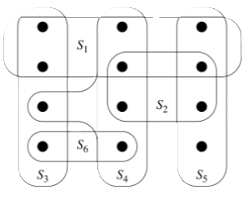

# Introdução

Neste módulo, vamos estudar problemas de **otimização combinatória** e **otimização em grafos**, discutindo conceitos, modelos matemáticos e implementações computacionais usando *solvers* de **programação linear inteira**.


<!-- _backgroundImage: url('https://spideryzarc.github.io/labCD/bg/light_lamp.jpg') -->
<!-- _footer: "" -->

---

# Apresentação do Curso

## Ementa
- Tipos de problemas de otimização combinatória e de otimização em redes.
- Empacotamento e cobertura via programação linear inteira e algoritmos de aproximação.
- Problemas de caminho mínimo: Dantzig, Dijkstra, Floyd.
- Problemas de fluxo: teorema Max Flow/Min Cut, algoritmos de aumento de fluxo e fluxo de custo mínimo.
- Árvores geradoras e algoritmos de Prim e Kruskal.

---

## Avaliação
- Provas teóricas (40%)
- Implementação de algoritmos (30%)
- Projeto final (30%)

<br><br>

> Sujeito a alterações.
---

## Bibliografia
- AHUJA, R.K.; MAGNANTI, T.L.; ORLIN, J.B. ***Network Flows: Theory, Algorithms, and Applications***. Prentice Hall, USA, 1993.
- BAZARAA, M.; JARVIS, A.; SHERALI, H. ***Linear Programming and Network Flows***. Wiley, 4ª. edição, 2011.
- SZWARCFITER, J. ***Grafos e Algoritmos Computacionais***. Campus, 2ª. Edição, 1986.


<!-- _backgroundImage: url('https://spideryzarc.github.io/labCD/bg/light_book.jpg') -->

---

- ARENALES, M.; ARMENTANO, V.; MORABITO, R; YANASSE, H. ***Pesquisa Operacional***. Editora Campus (Elsevier), 2ª. Edição, 2011.
- GOLDBARG, M.C. e LUNNA, H.P.L. ***Otimização Combinatória e Programação Linear: Modelos e Algoritmos***. 2ª Edição. Editora Campus Ltda, Rio de Janeiro, 2005.
- PAPADIMITRIOU, C.H.; STEIGLITZ, K. ***Combinatorial Optimization: Algorithms and Complexity***. Dover Publications, 1998.


<!-- _backgroundImage: url('https://spideryzarc.github.io/labCD/bg/light_book.jpg') -->

---

## Linguagens de Programação

- Todos os exemplos e atividades práticas serão realizados em **Python**.
- O aluno poderá entregar os trabalhos em **outras linguagens**, desde que seja uma linguagem 'popular', de **fácil compreensão e execução**.
- Como `solver` de programação linear inteira, será utilizado o **GUROBI** ou **SCIP**.

---

## Conhecimentos Prévios (Levantamento)

- **Programação:** Qual a sua experiência com programação? (Python, C++, Java, etc.)
- **Complexidade:** Já estudou complexidade de algoritmos? (Big-O, NP-Completo)
- **Programação Linear:** Já teve contato com programação linear ou otimização?
- **Teoria dos Grafos:** Já estudou teoria dos grafos? (Grafos, Árvores, etc.)

---

# O que é Otimização Combinatória?

* Processo de encontrar a **melhor solução** dentre um **conjunto finito** ou contável de soluções possíveis.
* No geral, uma solução para um problema de otimização combinatória pode ser visto como uma **sequência de decisões discretas** que levam a um resultado ótimo.
<br>
* **Aplicações:** Planejamento logístico, design de circuitos, alocação de recursos, etc.


---

# Problemas de Otimização

Neste primeiro módulo, vamos estudar problemas de otimização combinatória e otimização em redes, que são **problemas clássicos** em pesquisa operacional e ciência da computação.

Vamos discutir conceitos, modelos matemáticos e implementações computacionais usando *solvers* de programação linear inteira.

---


## Problema da Mochila (*knapsack*)

Dados um **conjunto de itens**, cada um com um **peso** e um **valor**, e uma mochila com **capacidade máxima**, o problema da mochila consiste em selecionar itens para **maximizar o valor total**, **sem exceder a capacidade** da mochila.


---
### Modelo de Programação Linear Inteira

- **Conjuntos:** $I = \{1,2,...,n\}$ de itens,
- **Parâmetros:** 
  - $v_i$ (valor do item $i$), 
  - $w_i$ (peso do item $i$), 
  - $W$ (capacidade da mochila).
- **Variáveis de Decisão:** $x_i \in \{0,1\}$, onde $x_i = 1$ se o item $i$ é selecionado.
- **Modelo:**
$$
\begin{align*}
\max & \sum_{i \in I} v_i x_i \\
\text{s.a.} & \sum_{i \in I} w_i x_i \leq W \\
& x_i \in \{0,1\} \quad \forall i \in I
\end{align*}
$$

---

### Preambulo Python

```python
from pyscipopt import Model
from pyscipopt import quicksum as qsum
import numpy as np
```

---

### Modelo PLI Implementado em Python (SCIP)

```python
def knapsack(C:int,profits:list,weights:list)->tuple:
    ''' C: int - capacity of the knapsack
        profits: list - list of profits of each item
        weights: list - list of weights of each item
        return: tuple - (max_profit, items)'''
    n = len(profits)
    model = Model("knapsack")
    x = [model.addVar(vtype="B") for i in range(n)]
    # add objective function
    model.setObjective(qsum(profits[i]*x[i] for i in range(n)), "maximize")
    # add constraints
    model.addCons(qsum(weights[i]*x[i] for i in range(n)) <= C)
    model.optimize() # solve the model
    max_profit = model.getObjVal() # get the optimal value
    # get the selected items
    items = [i for i in range(n) if model.getVal(x[i]) > 0.5]
    return max_profit, items
```
---

## Cobertura de Conjuntos (*set cover*)

Dado um **conjunto de elementos** e um **conjunto de subconjuntos**, o problema de cobertura de conjuntos consiste em selecionar o **menor número de subconjuntos** que **cubra todos os elementos**.

Se os conjuntos tiverem **custos associados**, o objetivo é **minimizar o custo total** dos subconjuntos selecionados.



---

### Modelo de Programação Linear Inteira

- **Conjuntos:** 
  - $I=\{1,2,...,n\}$ de elementos,
  - $S=\{s_1,s_2,...,s_m\}$ de subconjuntos.
- **Parâmetros:** 
  - $c_j$ (custo do subconjunto $s_j$),
  - $A_{ij}$ (1 se o elemento $i$ está no subconjunto $j$, 0 caso contrário).
- **Variáveis de Decisão:** $x_j \in \{0,1\}$, onde $x_j = 1$ se o subconjunto $j$ é selecionado.

---

- **Modelo:**
$$
\begin{align*}
\min & \sum_{j \in S} c_j x_j \\
\text{s.a.} & \sum_{j \in S} A_{ij} x_j \geq 1 \quad \forall i \in I \\
& x_j \in \{0,1\} \quad \forall j \in S
\end{align*}
$$

---

### Modelo PLI Implementado em Python (SCIP)

```python
def set_cover(n:int,costs:list,A:np.array)->tuple:
    ''' n: int - number of elements
        costs: list - list of costs of each subset
        A: np.array - binary matrix, A[i,j] = 1 if element i is in subset j 
        return: tuple - (min_cost, subsets)'''
    m = len(costs)
    model = Model("set_cover")
    x = [model.addVar(vtype="B") for j in range(m)]
    # add objective function
    model.setObjective(qsum(costs[j]*x[j] for j in range(m)), "minimize")
    # add constraints
    for i in range(n):
        model.addCons(qsum(A[i,j]*x[j] for j in range(m)) >= 1)
    model.optimize() # solve the model
    min_cost = model.getObjVal() # get the optimal value
    # get the selected subsets
    subsets = [j for j in range(m) if model.getVal(x[j]) > 0.5]
    return min_cost, subsets
```


---

## Empacotamento <br>(*bin packing*)

Dado um **conjunto de itens** e um conjunto de pacotes (*bins*) com **tamanhos fixos**, 
o problema de empacotamento consiste em distribuir os itens nos pacotes de forma a **minimizar o número de pacotes utilizados**.

Do ponto de vista do corte, o problema consiste em **cortar** um **material** em **peças menores** de forma a **minimizar o desperdício**.


---

### Modelo de Programação Linear Inteira

- **Conjuntos:** 
  - $I=\{1,2,...,n\}$ de itens,
  - $J=\{1,2,...,m\}$ de pacotes.
- **Parâmetros:** 
  - $w_i$ (demanda do item $i$),
  - $W_j$ (capacidade do pacote $j$),
- **Variáveis de Decisão:** 
  - $x_{ij} \in \{0,1\}$, onde $x_{ij} = 1$ se o item $i$ é colocado no pacote $j$.
  - $y_j \in \{0,1\}$, onde $y_j = 1$ se o pacote $j$ é utilizado.

---

- **Modelo:**

$$
\begin{align*}
\min & \sum_{j \in J} y_j \\
\text{s.a.} & \sum_{i \in I} w_i x_{ij} \leq W_j y_j \quad \forall j \in J \\
& \sum_{j \in J} x_{ij} = 1 \quad \forall i \in I \\
& x_{ij}, y_j \in \{0,1\} \quad \forall i \in I, j \in J
\end{align*}
$$

- ***Strengthening:*** opcionalmente, podemos adicionar a restrição:
  - $x_{ij} \leq y_j$ , $\forall i \in I, j \in J$ se quisermos que o item $i$ seja colocado no pacote $j$ apenas se o pacote $j$ for utilizado.

---

### Modelo PLI Implementado em Python (SCIP)

```python
def bpp(n:int,m:int,w:list,W:list)->tuple:
    model = Model("bpp")
    x = {(i,j):model.addVar(vtype="B") for i in range(n) for j in range(m)}
    y = [model.addVar(vtype="B") for j in range(m)]
    # add objective function
    model.setObjective(qsum(y), "minimize")
    # add constraints
    for i in range(n):
        model.addCons(qsum(x[i,j] for j in range(m)) == 1)
    for j in range(m):
        model.addCons(qsum(w[i]*x[i,j] for i in range(n)) <= W[j]*y[j])
    # optimize
    model.optimize()
    min_bins = model.getObjVal()
    bin_assignment = [next(j for j in range(m) if model.getVal(x[i,j]) > 0.5) 
                            for i in range(n)]
    return min_bins, bin_assignment
```
---

### Simetrias

- **Simetrias:** São soluções que são equivalentes entre si, mas que são representadas de forma diferente.
- **Exemplo:** Supondo uma solução com $k$ pacotes:
  - temos $\binom{m}{k}$ formas de escolher $k$ pacotes de $m$ a serem utilizados,
  - e para cada escolha, temos $k!$ formas de ordenar os pacotes.
  - Assim, temos $\binom{m}{k}k!$ soluções equivalentes.

---

- Para diminuir o número de soluções equivalentes, podemos adicionar **restrições de corte** ao modelo.
  - **Alternativa 1:** A soma dos pesos dos itens em um pacote deve ser **decrescente**.
    $$
    \sum_{i \in I} w_i x_{ij} \geq \sum_{i \in I} w_i x_{ij'} \quad \forall j < j'
    $$
  - **Alternativa 2:** O item $i$ só pode ser colocado no pacote $j$ se $i\leq j$.
    $$
    x_{ij} = 0 \quad \forall i \in I, j \in J, j > i
    $$
   
> As duas alternativas **não funcionam juntas**, pois pode tornar o modelo **inviável**.
---

## Problema do Caixeiro Viajante <br>(*traveling salesman problem*)

Dado um **conjunto de cidades** e as **distâncias** entre elas, o problema do caixeiro viajante consiste em encontrar a **rota mais curta** que **visite todas as cidades uma vez** e retorne à cidade de origem.

O problema é **NP-Completo**, o que significa que não existe um algoritmo eficiente para resolvê-lo em tempo polinomial.


---

### Modelo de Programação Linear Inteira (MTZ)
Miller-Tucker-Zemlin (1960)
- **Conjuntos:** 
  - $I=\{0,1,2,...,n-1\}$ : cidades,
  - $I'= I/\{0\}$ : cidades excluindo a cidade de origem.
  - $A=\{(i,j): i,j \in I\}$ : arcos.
- **Parâmetros:**  $d_{ij}$ (distância entre as cidades $i$ e $j$).
- **Variáveis de Decisão:** 
  - $x_{ij} \in \{0,1\}$, onde $x_{ij} = 1$ se o arco $(i,j)$ é selecionado.
  - $u_i \in \mathbb{Z}$, onde $u_i$ é a posição da cidade $i$ na rota.

---

- **Modelo:**
$$
\begin{align*}
\min & \sum_{(i,j) \in A} d_{ij} x_{ij} \\
\text{s.a.} & \sum_{j \in I} x_{ij} = 1 \quad \forall i \in I \\
& \sum_{i \in I} x_{ij} = 1 \quad \forall j \in I \\
& u_i - u_j + n.x_{ij} \leq n-1 \quad \forall i \in I, j \in I', i \neq j \\
& x_{ij} \in \{0,1\} \quad \forall (i,j) \in A\\
& u_i \in \mathbb{Z^+} \quad \forall i \in I
\end{align*}
$$
> onde $n$ é o número de cidades.

---

### Modelo PLI Implementado em Python (SCIP)

```python
def tsp_mtz(c:np.array)->tuple:
    n = c.shape[0]
    model = Model("tsp")
    x = {(i,j):model.addVar(vtype="B") for i in range(n) for j in range(n)}
    u = [model.addVar(vtype="C") for i in range(n)]
    model.setObjective(qsum(c[i,j]*x[i,j] for i in range(n) for j in range(n)), "minimize")
    for i in range(n):
        model.addCons(qsum(x[i,j] for j in range(n) if i!=j ) == 1)
        model.addCons(qsum(x[j,i] for j in range(n) if i!=j ) == 1)
    for i in range(n):
        for j in range(1,n):
            if i != j: model.addCons(u[i] - u[j] + n*x[i,j] <= n-1)
    model.optimize()
    min_cost = model.getObjVal()
    u_val = [model.getVal(u[i]) for i in range(n)]
    tour = np.argsort(u_val)
    return min_cost, tour
```

---

### Modelo de Programação Linear Inteira (DFJ)
Dantzig-Fulkerson-Johnson (1954)

- **Conjuntos:** 
  - $I=\{0,1,2,...,n-1\}$ : cidades,
  - $A=\{(i,j): i,j \in I\}$ : arcos.
- **Parâmetros:**  $d_{ij}$ (distância entre as cidades $i$ e $j$).
- **Variáveis de Decisão:** 
  - $x_{ij} \in \{0,1\}$, onde $x_{ij} = 1$ se o arco $(i,j)$ é selecionado.

---

- **Modelo:**
$$
\begin{align*}
\min & \sum_{(i,j) \in A} d_{ij} x_{ij} \\
\text{s.a.} & \sum_{j \in I} x_{ij} = 1 \quad \forall i \in I \\
& \sum_{i \in I} x_{ij} = 1 \quad \forall j \in I \\
& \sum_{(i,j) \in S}^{i\neq j} x_{ij} \leq \sharp(S)-1 \quad \forall S \subset I, 2 \leq \sharp(S) \leq \lfloor n/2 \rfloor \\
& x_{ij} \in \{0,1\} \quad \forall (i,j) \in A
\end{align*}
$$

> Onde $S$ é um subconjunto de cidades, e $\sharp(S)$ é o número de elementos em $S$.
> Observe que a restrição de *subtour elimination* é **exponencial**, o que torna o modelo impraticável para **instâncias** grandes.
  
---

Uma variação da restrição de *subtour elimination*:

$$
\begin{align*}
& \sum_{i \in S}\sum_{j \notin S} x_{ij} \geq 1 \quad \forall S \subset I, 2 \leq \sharp(S) \leq \lfloor n/2 \rfloor \\
\end{align*}
$$

- $S$ pode ser limitado por $\sharp(S) \leq \lfloor n/2 \rfloor$ para reduzir o número de restrições pela metade. Pois só pode haver subtours maiores que $n/2$ cidades se houver subtours menores que $n/2$ cidades.
- Isso **não reduz a complexidade** do modelo, mas pode torná-lo mais eficiente **um pouco**.
- Se adicionarmos todas as restrições, podemos **relaxar a restrição de integralidade** e resolver o problema como um problema de programação linear. Pois as restrições de *subtour elimination* garantem que a solução seja um ciclo Hamiltoniano.
 

---

### Modelo PLI Implementado em Python (SCIP)

```python
def tsp_all_subtours(c: np.array) -> tuple:
    n = c.shape[0]
    model = Model("tsp")
    x = {(i, j): model.addVar(vtype="M", lb=0, ub=1) for i in range(n) for j in range(n) if i != j}
    # add objective function
    model.setObjective(qsum(c[i, j]*x[i, j] for i in range(n) for j in range(n) if i != j), "minimize")
    # add degree constraints
    for i in range(n):
        model.addCons(qsum(x[i, j] for j in range(n) if i != j) == 1)
        model.addCons(qsum(x[j, i] for j in range(n) if i != j) == 1)
    # All possible subsets of nodes of size 2 to n//2 as Python generator
    S = (s for k in range(2, n//2) for s in comb(range(n), k))
    for s in S:
        model.addCons(qsum(x[i, j] for i in s for j in s if i != j) <= len(s) - 1)
    # optimize
    model.optimize()
    # extract solution
    min_cost = model.getObjVal()
    nxt = next(i for i in range(1, n) if model.getVal(x[0, i]) > 0.5)
    while nxt != 0:
        tour.append(nxt)
        nxt = next(i for i in range(n) if tour[-1] != i and model.getVal(x[tour[-1], i]) > 0.5)
    return min_cost, tour
```

---

 * Na prática, **relaxamos** a restrição de *subtour elimination* e resolvemos o problema iterativamente,
 * A cada iteração, identificamos *subtours* e adicionamos restrições para eliminá-los.
 * As restrições relaxadas são chamadas de ***lazy constraints***.
 * Não confundir com *cutting planes*, que são restrições adicionadas ao modelo para melhorar a convergência.
   * ***Lazy constraints*** são necessárias para garantir a **correção** do modelo (sem elas, o modelo pode retornar soluções inválidas),
   * ***Cutting planes*** são utilizadas para **melhorar a eficiência** do modelo durante o processo de *branch-and-bound*.
 
---

### Modelo Iterativo

```python
def tsp_adhoc_subtours(c: np.array) -> tuple:
    n = c.shape[0]
    model = Model("tsp")
    x = {(i, j): model.addVar(vtype="B") for i in range(n) for j in range(n) if i != j}
    model.setObjective(qsum(c[i, j]*x[i, j] for i in range(n) for j in range(n) if i != j), "minimize")
    for i in range(n):
        model.addCons(qsum(x[i, j] for j in range(n) if i != j) == 1)
        model.addCons(qsum(x[j, i] for j in range(n) if i != j) == 1)
    # optimize iteratively
    unfeasible = True # flag for unfeasible solution
    visited = np.zeros(n, dtype=bool)  # visited nodes
    while unfeasible:
        model.optimize() # solve the model
        tours = []  # list of subtours found
        visited.fill(False) # reset visited nodes
        for start in range(n): # find subtours
            if visited[start]: continue # skip visited nodes as start
            tour = [start]
            nxt = next(i for i in range(n) if start != i and model.getVal(x[start, i]) > 0.5)
            while nxt != start:
                tour.append(nxt)
                visited[nxt] = True
                nxt = next(i for i in range(n) if tour[-1] != i and model.getVal(x[tour[-1], i]) > 0.5)
            if len(tour) == n: # feasible solution found
                unfeasible = False
                break
            elif len(tour) <= n//2:  # ignore subtours with more than n//2 nodes
                tours.append(tour)
        if unfeasible:
            model.freeTransform()  # free transformation for adding constraints
            for tour in tours: # add subtour elimination constraints
                model.addCons(qsum(x[i, j] for i in tour for j in tour if i != j) <= len(tour) - 1)
    min_cost = model.getObjVal()
    return min_cost, tour
```

---

## Árvore Geradora Mínima <br> (*minimum spanning tree*)

Dado um **grafo conexo** e **ponderado**, o problema da árvore geradora mínima consiste em encontrar a **árvore** que conecta todos os vértices com o **menor custo total**.

 

<br>

> Árvore na teoria dos grafos é um subgrafo **conexo** e **acíclico**.
---

### Modelo de Programação Linear Inteira

- **Conjuntos:** 
  - $I=\{1,2,...,n\}$ de vértices,
  - $A=\{(i,j): i,j \in I, i < j\}$ de arestas.
- **Parâmetros:** $c_{ij}$ (custo da aresta $(i,j)$).
- **Variáveis de Decisão:** $x_{ij} \in \{0,1\}$, onde $x_{ij} = 1$ se a aresta $(i,j)$ é selecionada.

---

- **Modelo:** Eliminação de Ciclos

$$
\begin{align*}
\min & \sum_{(i,j) \in A} c_{ij} x_{ij} \\
\text{s.a.} & \sum_{(i,j) \in A} x_{ij} = n-1 \\
& \sum_{(i,j) \in S}^{i<j} x_{ij} \leq \sharp(S)-1 \quad \forall S \subset I, ~ 2 \leq \sharp(S) \leq n-1 \\
& x_{ij} \in \{0,1\} \quad \forall (i,j) \in A
\end{align*}
$$

> Onde $S$ é um subconjunto de vértices, e $\sharp(S)$ é o número de elementos em $S$.
> $x_{ij}$ pode ser relaxado para $x_{ij} \in [0,1]$.

---

### Modelo PLI Implementado em Python (SCIP)

```python
def mst_all_circles(c: np.array) -> tuple:
    n = c.shape[0]
    model = Model("mst")
    x = {(i, j): model.addVar(vtype="C", lb=0,ub=1) for j in range(1,n) for i in range(j)}
    # add objective function
    model.setObjective(qsum(c[i, j]*x[i, j] for i,j in x), "minimize")
    # add constraints
    model.addCons(qsum(x[i,j] for i,j in x) == n-1)
    # All possible subsets of nodes of size 2 to n-1 as Python generator
    S = (s for k in range(2, n) for s in comb(range(n), k))
    for s in S:
        model.addCons(qsum(x[i, j] for i in s for j in s if i < j) <= len(s)-1)
    # optimize
    model.optimize()
    min_cost = model.getObjVal()
    arcs = [(i, j) for i,j in x if model.getVal(x[i, j]) > 0.5]
    # print running time
    print("Running time: ", model.getSolvingTime())
    return min_cost, arcs
```

---

Alternativamente os subciclos podem ser eliminados com a restrição:
$$
\begin{align*}
& \sum_{(i,j) \in \delta(S)} x_{ij} \geq 1 \quad \forall S \subsetneq I, S \neq \emptyset \\
\end{align*}
$$
Onde $\delta(S)$ é o conjunto de arestas que conectam o subconjunto $S$ ao restante do grafo.

- A restrição de *subtour elimination* é **exponencial**, o que torna o modelo impraticável para **instâncias** grandes.
- Também podemos usar a abordagem **iterativa** para resolver o problema, adicionando restrições de *subtour elimination* conforme necessário.	
- Para resolver o problema de **forma eficiente**, utilizamos algoritmos como **Prim** e **Kruskal** que veremos mais adiante.

---

### Modelo Iterativo

```python
def mst_adhoc_circle(c: np.array, min_degree_const=True) -> tuple:
    n = c.shape[0]
    model = Model("mst")
    x = {(i, j): model.addVar(vtype="B") for j in range(1, n) for i in range(j)}
    model.setObjective(qsum(c[i, j]*x[i, j] for i, j in x), "minimize")    
    model.addCons(qsum(x.values()) == n-1) # number of arcs constraint
    # add minimum degree constraint (speed up)
    if min_degree_const:
        for k in range(n):
            model.addCons(qsum(x[i, j] for i, j in x if j == k or i == k) >= 1)    
    # optimize iteratively
    adj = np.zeros((n, n), dtype=bool)
    while True:
        model.optimize()
        # extract adjacency matrix
        adj.fill(False)
        for i, j in x: 
            if model.getVal(x[i, j]) > 0.5:
                adj[i, j] = adj[j, i] = True        
        circle = find_circle(adj) # find a circle using DFS
        if not circle: # no circle found
            break
        # add subtour elimination constraint
        model.freeTransform()
        model.addCons(qsum(x[i, j] for i in circle for j in circle if i < j) <= len(circle)-1)
    # end while
    min_cost = model.getObjVal()
    arcs = [(i, j) for i, j in x if model.getVal(x[i, j]) > 0.5]    
    return min_cost, arcs
```
---

#### Função para Encontrar um Ciclo

```python
def find_circle(adj: np.array) -> list:
    n = len(adj)
    visited = np.zeros(n, dtype=bool) # visited nodes
    parent = np.full(n, -1, dtype=np.int16) # parent nodes in the DFS
    def dfs(u): # depth-first search
        visited[u] = True
        for v in range(n):
            if adj[u][v]:
                if not visited[v]:
                    parent[v] = u
                    cycle = dfs(v) # recursive call
                    if cycle: return cycle
                elif v != parent[u]:
                    # Found a cycle, reconstruct the path
                    cycle = [v, u]
                    curr = u
                    while parent[curr] != -1 and parent[curr] != v:
                        curr = parent[curr]
                        cycle.append(curr)
                    return cycle
        return None # backtrack
    # for each not visited node start a DFS
    for u in range(n):
        if not visited[u]:
            cycle = dfs(u)
            if cycle: return cycle
    return None
```

---

## Caminho Mínimo <br> (*shortest path*)

Dado um **grafo** com **arestas ponderadas** e um **vértice de origem**, o problema do caminho mínimo consiste em encontrar o **caminho de menor custo** entre o vértice de origem e todos os outros vértices ou um vértice de destino.


---

### Modelos de Programação Linear Inteira

- **Conjuntos:** 
  - $I=\{1,2,...,n\}$ de vértices,
  - $A=\{(i,j): i,j \in I\}$ de arestas.
- **Parâmetros:** 
  - $c_{ij}$ : custo da aresta $(i,j)$,
  - $s$ : vértice de origem.
  - $t$ : vértice de destino.
- **Variáveis de Decisão:** 
  - $x_{ij} \in \{0,1\}$, onde $x_{ij} = 1$ se a aresta $(i,j)$ é selecionada.

---

- **Modelo:**  

$$
\begin{align*}
\min & \sum_{(i,j) \in A} c_{ij} x_{ij} \\
\text{s.a.} & \\
& \sum_{j \in I}^{j\neq k} x_{kj} - \sum_{i \in I}^{i\neq k}x_{ik} =  \begin{cases} 1 & \text{se } k = s \\ -1 & \text{se } k = t \\ 0 & \text{caso contrário} \end{cases} \quad \forall k \in I \\
& x_{ij} \in \{0,1\} \quad \forall (i,j) \in A
\end{align*}
$$

---

### Modelo PLI Implementado em Python (SCIP)

```python
def shortest_path(n: int, edges: dict, s: int, t: int) -> tuple:
    model = Model("shortest_path")
    x = {(i, j): model.addVar(vtype="C", lb=0, ub=1) for i, j in edges}
    # add objective function
    model.setObjective(qsum(edges[i, j]*x[i, j] for i, j in edges), "minimize")
    # add constraints
    for k in range(n):
      if k == s:
          model.addCons(qsum(x[k, j] for j in range(n) if (k, j) in edges)
                        - qsum(x[i, k] for i in range(n) if (i, k) in edges) == 1)
      elif k == t:
          model.addCons(qsum(x[k, j] for j in range(n) if (k, j) in edges)
                        - qsum(x[i, k] for i in range(n) if (i, k) in edges) == -1)
      else:
          model.addCons(qsum(x[k, j] for j in range(n) if (k, j) in edges)
                        - qsum(x[i, k] for i in range(n) if (i, k) in edges) == 0)        
    # optimize
    model.optimize()
    if model.getStatus() == "infeasible": return np.inf, []
    # extract solution
    min_cost = model.getObjVal()
    path = [s]
    while path[-1] != t:
        path.append(next(j for i, j in edges if i == path[-1] and model.getVal(x[i, j]) > 0.5))
    return min_cost, path
```

---

## Fluxo Máximo <br> (*maximum flow*)

Dado um **grafo** com **capacidades** nas arestas e dois vértices especiais, o problema do fluxo máximo consiste em encontrar o **fluxo máximo** que pode ser enviado do vértice de **origem** ao vértice de **destino**, determinando a quantidade de fluxo que passa por cada aresta.


---

### Modelos de Programação Linear Inteira

- **Conjuntos:** 
  - $I=\{1,2,...,n\}$ de vértices,
  - $A=\{(i,j): i,j \in I\}$ de arestas.
- **Parâmetros:** 
  - $c_{ij}$ : capacidade da aresta $(i,j)$,
  - $s$ : vértice de origem.
  - $t$ : vértice de destino.
- **Variáveis de Decisão:**
  - $x_{ij} \in \mathbb{R}^+$, onde $x_{ij}$ é o fluxo na aresta $(i,j)$ para $i \neq t, j \neq s$. 

---

- **Modelo:**

$$
\begin{align*}
\max & \sum_{j \in I} x_{sj}  + \epsilon \sum_{(i,j) \in A} x_{ij} \\
\text{s.a.} & \\
& \sum_{j \in I} x_{kj} - \sum_{j \in I} x_{jk} = 0 \quad \forall k \in I / \{s,t\} \\
& 0 \leq x_{ij} \leq c_{ij} \quad \forall (i,j) \in A, i \neq t, j \neq s \\
\end{align*}
$$


> Onde $\epsilon$ é um valor muito pequeno, usado para evitar que o solver retorne uma solução com **fluxos circulares**.
---

### Modelo PLI Implementado em Python (SCIP)

```python
def max_flow(n: int, edges: dict, s: int, t: int) -> tuple:
 model = Model("max_flow")
    x = {(i, j): model.addVar(vtype="C", lb=0, ub=cap) 
         for (i, j), cap in edges.items() 
            if i != t and j != s} # exclude source and sink nodes
    # Objective: maximize total flow out of source
    model.setObjective(qsum(x[s, j] for j in range(n) if (s, j) in x) +
                       qsum(x[i, j]*-1e-6 for i,j in x), "maximize")
    # Flow conservation constraints
    for k in range(n):
        if k not in (s, t):
            model.addCons(qsum(x[i, k] for i in range(n) if (i, k) in x) ==
                      qsum(x[k, j] for j in range(n) if (k, j) in x))
    
    # Solve the model
    model.hideOutput()
    model.optimize()
    if model.getStatus() != "optimal":
        return 0, {}
    max_flow_value = model.getObjVal()
    flow = {(i, j): model.getVal(x[i, j]) for (i, j) in x}
    return max_flow_value, flow
```

---

# Conclusão

Neste módulo, estudamos problemas clássicos de otimização combinatória e otimização em grafos, discutindo conceitos, modelos matemáticos e implementações computacionais usando *solvers* de programação linear inteira.

No próximo módulo, vamos estudar algoritmos clássicos para resolver esses problemas, como Dijkstra, Floyd-Warshall, Prim, Kruskal, Ford-Fulkerson, entre outros.


